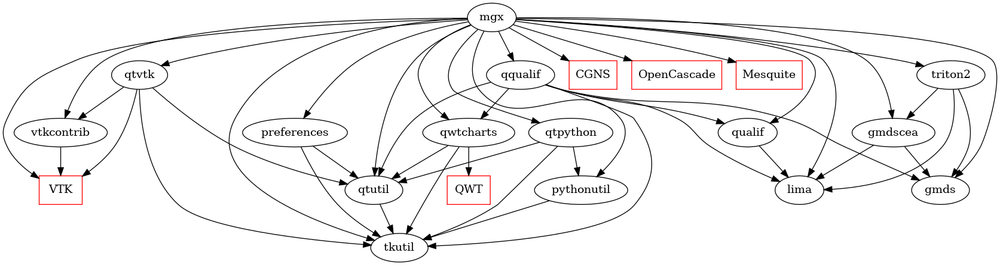

# lihpccg-ci
Common tools for Continuous Integration (CI) 

## Packages

This repository contains 5 docker images (Packages section - right of the main page):
- **spack-mgx**: image based on Ubuntu and built with [Spack](https://spack.io/) containing mgx.
- **spack-cgcore**: LIHPC-CG core image based on Ubuntu and built with [Spack](https://spack.io/). It mainly contains Open Cascade and VTK.
- **spack-cgcore-mgx**: image based on spack-cgcore containing mgx and all its dependencies (other repositories of [LIHPC-CG organization](https://github.com/LIHPC-Computational-Geometry/). This image is built with [Spack](https://spack.io/).
- **cmake-cgcore**: LIHPC-CG core image based on Ubuntu and built with [Cmake](https://cmake.org/). It contains Open Cascade and VTK.
- **cmake-cgcore-mgx**: image based on cmake-cgcore containing mgx and all its dependencies (other repositories of [LIHPC-CG organization](https://github.com/LIHPC-Computational-Geometry/). This image is built with [Cmake](https://cmake.org/).

## Dependencies

The following graph shows the dependencies between LIHPC-CG projects.

This graph represents the explicit dependencies of the `cmake-cgcore-mgx` docker image.

The red square nodes are external products not installed with `apt install`: they are downloaded and installed in `cmake-cgcore` docker image.
The black round nodes are LIHPC-CG projects.

